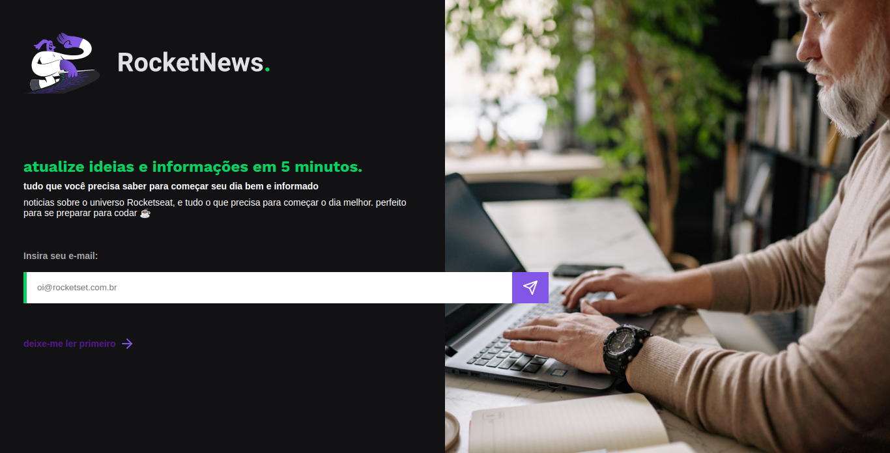
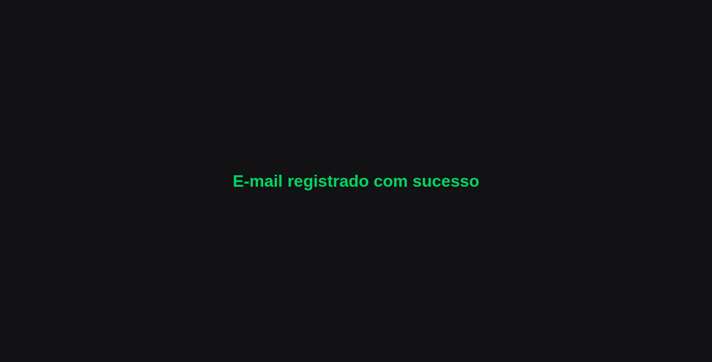
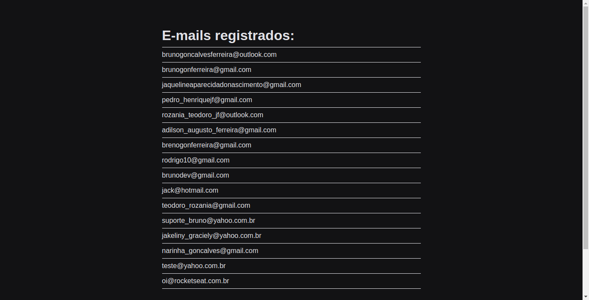

<h1 align="center">
    Desafio: RocketNews
</h1>

<p align="center">
 <a href="#-sobre-o-projeto">Sobre</a> •
 <a href="#-layout">Layout</a> • 
 <a href="#-como-executar-o-projeto">Como executar</a> • 
 <a href="#-tecnologias">Tecnologias</a> • 
 <a href="#-autor">Autor</a> • 
</p>

## 💻 Sobre o projeto

Neste desafio você vai construir uma página para a captação de leads ou newsletter.

---

## ⚙️ Funcionalidades

- [x] Cadastrando e-mails:

  - [x] O usuário preenche seu email na aplicação web.
  - [x] Os e-mails são salvos em um banco de dados.

---

## 🎨 Layout

O layout da aplicação:

<p align="center" style="display: flex; align-items: flex-start; justify-content: center;">
  

</p>
<p align="center" style="display: flex; align-items: flex-start; justify-content: center;">
  

</p>
<p align="center" style="display: flex; align-items: flex-start; justify-content: center;">
  

</p>

---

## 🚀 Como executar o projeto

Este projeto é divido em duas partes:

1. Backend
2. Frontend

💡Frontend precisa que o Backend esteja sendo executado para funcionar.

### Pré-requisitos

Antes de começar, você vai precisar ter instalado em sua máquina as seguintes ferramentas:
[Git](https://git-scm.com), [Node.js](https://nodejs.org/en/).
Além disto é bom ter um editor para trabalhar com o código como [VSCode](https://code.visualstudio.com/)

#### 🎲 Rodando o Frontend e o Backend (servidor)

```bash

# Clone este repositório
$ git clone https://github.com/brunogoncalvesferreira/rocket-news.git

# Acesse a pasta do projeto no terminal/cmd
$ cd rocket-news

# Instale as dependências
$ npm install

# Execute a aplicação
$ npm start

# O servidor inciará na porta:3000 - acesse http://localhost:3000

```

---

## 🛠 Tecnologias

As seguintes ferramentas foram usadas na construção do projeto:

- [Javascript](https://developer.mozilla.org/pt-BR/docs/Web/JavaScript)
- [SQlite3](https://www.sqlite.org/index.html)
- [Express](https://expressjs.com/pt-br/)
- [NodeJS](https://nodejs.org/en/)
- [Nunjucks](https://mozilla.github.io/nunjucks/)
- [HTML](https://developer.mozilla.org/pt-BR/docs/Web/HTML)
- [CSS](https://developer.mozilla.org/pt-BR/docs/Web/CSS)

---

## 🦸 Autor

<a href="https://github.com/brunogoncalvesferreira"><br /><sub><b>Bruno Gonçalves</b></sub></a></a>
<br />

[](https://twitter.com/BrunoGoferreir) [](https://www.linkedin.com/in/bruno-goncalves-ferreira/)
[](mailto:brunogonferreira@gmail.com)
